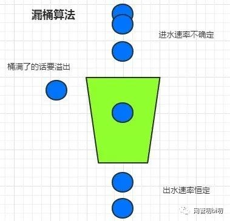
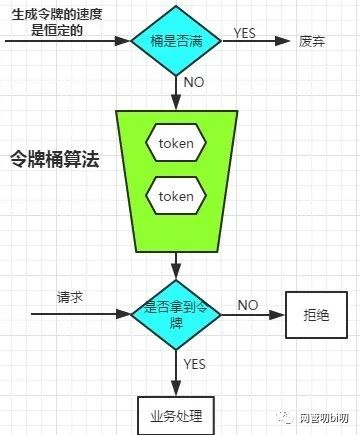

## 限流(rate limit)算法
在高并发业务场景下，保护系统时，常用的"三板斧"有："熔断、降级和限流"。今天和大家谈谈常用的限流算法的几种实现方式，这里所说的限流并非是网关层面的限流，而是业务代码中的逻辑限流。

限流算法常用的几种实现方式有如下四种：

1. 固定窗口(计数器)
2. 滑动窗口
3. 漏桶
4. 令牌桶

### 固定窗口
实现demo
```go
package main
import "time"
import "sync"
type LimitRate struct {
	rate  int           //阀值,一个周期最多接受请求数
	begin time.Time     //计数开始时间
	cycle time.Duration //计数周期
	count int           //周期内收到的请求数
	lock  sync.Mutex    //锁
}
func (limit *LimitRate) reset(begin time.Time) {
	limit.begin = begin
	limit.count = 0
}

// Allow 判断请求是否允许,是否超过设置的速率
func (limit *LimitRate) Allow() bool {
	limit.lock.Lock()
	defer limit.lock.Unlock()
	now := time.Now()
	// 判断请求是否在周期内
	if now.Sub(limit.begin) >= limit.cycle {
		// 超出周期,重置为当前时间周期
		limit.reset(now)
	}
	// 判断收到请求数是否达到阀值
	if limit.count == limit.rate {
		return false
	} else {
		limit.count++
		return true
	}
}

func NewLimitRate(rate int, cycle time.Duration)*LimitRate {
	limit:=&LimitRate{}
	limit.rate = rate
	limit.begin = time.Now()
	limit.cycle = cycle
	limit.count = 0
	return limit
}


func main() {
	// 每秒,通过2个请求
	limit:=NewLimitRate(2,time.Second)
	c:=0
	for i := 0; i < 100; i++ {
		time.Sleep(time.Millisecond*100)
		if limit.Allow(){
			c++
			println(i,c)
		}
	}
}
```
### 滑动窗口(sliding window)
滑动窗口算法将一个大的时间窗口分成多个小窗口，每次大窗口向后滑动一个小窗口，并保证大的窗口内流量不会超出最大值，这种实现比固定窗口的流量曲线更加平滑。

普通时间窗口有一个问题，比如窗口期内请求的上限是100，假设有100个请求集中在前1s的后100ms，100个请求集中在后1s的前100ms，其实在这200ms内就已经请求超限了，但是由于时间窗每经过1s就会重置计数，就无法识别到这种请求超限。

对于滑动时间窗口，我们可以把1ms的时间窗口划分成10个小窗口，或者想象窗口有10个时间插槽time slot, 每个time slot统计某个100ms的请求数量。每经过100ms，有一个新的time slot加入窗口，早于当前时间1s的time slot出窗口。窗口内最多维护10个time slot。

链接和下面代码未仔细阅读
[参考链接](https://github.com/kevinyan815/gocookbook/issues/26)
```go
package main

import (
	"fmt"
	"sync"
	"time"
)


type timeSlot struct {
	timestamp time.Time // 这个timeSlot的时间起点
	count     int       // 落在这个timeSlot内的请求数
}

// 统计整个时间窗口中已经发生的请求次数
func countReq(win []*timeSlot) int {
	var count int
	for _, ts := range win {
		count += ts.count
	}
	return count
}

type SlidingWindowLimiter struct {
	mu           sync.Mutex    // 互斥锁保护其他字段
	SlotDuration time.Duration // time slot的长度
	WinDuration  time.Duration // sliding window的长度
	numSlots     int           // window内最多有多少个slot
	windows      []*timeSlot
	maxReq       int // 大窗口时间内允许的最大请求数
}

func NewSliding(slotDuration time.Duration, winDuration time.Duration, maxReq int) *SlidingWindowLimiter {
	return &SlidingWindowLimiter{
		SlotDuration: slotDuration,
		WinDuration:  winDuration,
		numSlots:     int(winDuration / slotDuration),
		maxReq:       maxReq,
	}
}


func (l *SlidingWindowLimiter) validate() bool {
	l.mu.Lock()
	defer l.mu.Unlock()


	now := time.Now()
	// 已经过期的time slot移出时间窗
	timeoutOffset := -1
	for i, ts := range l.windows {
		if ts.timestamp.Add(l.WinDuration).After(now) {
			break
		}
		timeoutOffset = i
	}
	if timeoutOffset > -1 {
		l.windows = l.windows[timeoutOffset+1:]
	}

	// 判断请求是否超限
	var result bool
	if countReq(l.windows) < l.maxReq {
		result = true
	}

	// 记录这次的请求数
	var lastSlot *timeSlot
	if len(l.windows) > 0 {
		lastSlot = l.windows[len(l.windows)-1]
		if lastSlot.timestamp.Add(l.SlotDuration).Before(now) {
			// 如果当前时间已经超过这个时间插槽的跨度，那么新建一个时间插槽
			lastSlot = &timeSlot{timestamp: now, count: 1}
			l.windows = append(l.windows, lastSlot)
		} else {
			lastSlot.count++
		}
	} else {
		lastSlot = &timeSlot{timestamp: now, count: 1}
		l.windows = append(l.windows, lastSlot)
	}


	return result
}

func (l *SlidingWindowLimiter) LimitTest() string {
	if l.validate() {
		return "Accepted"
	} else {
		return "Ignored"
	}
}

func main() {
	limiter := NewSliding(100*time.Millisecond, time.Second, 10)
	for i := 0; i < 5; i++ {
		fmt.Println(limiter.LimitTest())
	}
	time.Sleep(100 * time.Millisecond)
	for i := 0; i < 5; i++ {
		fmt.Println(limiter.LimitTest())
	}
	fmt.Println(limiter.LimitTest())
	for _, v := range limiter.windows {
		fmt.Println(v.timestamp, v.count)
	}

	fmt.Println("moments later...")
	time.Sleep(time.Second)
	for i := 0; i < 7; i++ {
		fmt.Println(limiter.LimitTest())
	}
	for _, v := range limiter.windows {
		fmt.Println(v.timestamp, v.count)
	}
}
```
### 漏桶

#### 算法思想
漏桶算法是首先想象有一个木桶，桶的容量是固定的。当有请求到来时先放到木桶中，处理请求的worker以固定的速度从木桶中取出请求进行相应。如果木桶已经满了，直接返回请求频率超限的错误码或者页面
#### 适用场景
漏桶算法是流量最均匀的限流实现方式，一般用于流量“整形”。例如保护数据库的限流，先把对数据库的访问加入到木桶中，worker再以db能够承受的qps从木桶中取出请求，去访问数据库。

#### 存在的问题
木桶流入请求的速率是不固定的，但是流出的速率是恒定的。这样的话能保护系统资源不被打满，但是面对突发流量时会有大量请求失败，不适合电商抢购和微博出现热点事件等场景的限流。
#### 三方库
##### go.uber.org/ratelimit
这个库为用来控制桶中水的流出恒定速度(也就是恒定消费)
[参考文档](https://zhuanlan.zhihu.com/p/441221638?utm_source=wechat_session&utm_medium=social&utm_oi=1116387434165948416&utm_campaign=shareopn)
```go
package main
import (
 "fmt"
 "time"

 "go.uber.org/ratelimit"
)

func main() {
    // 每秒100个,每10毫秒漏一个
    rl := ratelimit.New(100) // per second
	// ratelimit.WithoutSlack为不允许slack(松弛) 
    // limiter := ratelimit.New(100, ratelimit.WithoutSlack)
	prev := time.Now()
    for i := 0; i < 10; i++ {
        now := rl.Take()
        fmt.Println(i, now.Sub(prev))
        prev = now
    }
}
```
#### demo

```Java
long timeStamp = getNowTime(); 
int capacity = 10000;// 桶的容量
int rate = 1;//水漏出的速度
int water = 100;//当前水量

public static bool control() {   
    //先执行漏水，因为rate是固定的，所以可以认为“时间间隔*rate”即为漏出的水量
    long  now = getNowTime();
    water = Math.max(0, water - (now - timeStamp) * rate);
    timeStamp = now;

    if (water < capacity) { // 水还未满，加水
        water ++; 
        return true; 
    } else { 
        return false;//水满，拒绝加水
   } 
} 
```
```golang
// 一个固定大小的桶，请求按照固定的速率流出
// 请求数大于桶的容量，则抛弃多余请求

type LeakyBucket struct {
   rate       float64    // 每秒固定流出速率
   capacity   float64    // 桶的容量
   water      float64    // 当前桶中请求量
   lastLeakMs int64      // 桶上次漏水微秒数
   lock       sync.Mutex // 锁
}

func (leaky *LeakyBucket) Allow() bool {
   leaky.lock.Lock()
   defer leaky.lock.Unlock()

   now := time.Now().UnixNano() / 1e6
   // 计算剩余水量,两次执行时间中需要漏掉的水
   leakyWater := leaky.water - (float64(now-leaky.lastLeakMs) * leaky.rate / 1000)
   leaky.water = math.Max(0, leakyWater)
   leaky.lastLeakMs = now
   if leaky.water+1 <= leaky.capacity {
      leaky.water++
      return true
   } else {
      return false
   }
}

func (leaky *LeakyBucket) Set(rate, capacity float64) {
   leaky.rate = rate
   leaky.capacity = capacity
   leaky.water = 0
   leaky.lastLeakMs = time.Now().UnixNano() / 1e6
}
```

### 令牌桶


#### 算法思想

**令牌桶是反向的"漏桶"**，它是以恒定的速度往木桶里加入令牌，木桶满了则不再加入令牌。服务收到请求时尝试从木桶中取出一个令牌，如果能够得到令牌则继续执行后续的业务逻辑。如果没有得到令牌，直接返回访问频率超限的错误码或页面等，不继续执行后续的业务逻辑。

**特点：由于木桶内只要有令牌，请求就可以被处理，所以令牌桶算法可以支持突发流量。**
同时由于往木桶添加令牌的速度是恒定的，且木桶的容量有上限，所以单位时间内处理的请求书也能够得到控制，起到限流的目的。假设加入令牌的速度为 1token/10ms，桶的容量为500，在请求比较的少的时候（小于每10毫秒1个请求）时，木桶可以先"攒"一些令牌（最多500个）。当有突发流量时，一下把木桶内的令牌取空，也就是有500个在并发执行的业务逻辑，之后要等每10ms补充一个新的令牌才能接收一个新的请求。

#### 参数设置

木桶的容量  - 考虑业务逻辑的资源消耗和机器能承载并发处理多少业务逻辑。

生成令牌的速度 - 太慢的话起不到“攒”令牌应对突发流量的效果。

#### 适用场景

适合电商抢购或者微博出现热点事件这种场景，因为在限流的同时可以应对一定的突发流量。如果采用漏桶那样的均匀速度处理请求的算法，在发生热点时间的时候，会造成大量的用户无法访问，对用户体验的损害比较大。
#### 三方库
消费令牌桶中的token,如果桶中token有堆积可以进行一次性消费(这样可以应对突发流量)
[参考文档](https://www.cnblogs.com/jackey2015/p/11843626.html)
```go
import "golang.org/x/time/rate"
limiter := NewLimiter(10, 1);
```
* 第一个参数是 r Limit。代表每秒可以向 Token 桶中产生多少 token。Limit 实际上是 float64 的别名。
* 第二个参数是 b int。b 代表 Token 桶的容量大小。
* 那么，对于以上例子来说，其构造出的限流器含义为，其令牌桶大小为 1, 以每秒 10 个 Token 的速率向桶中放置 Token。
#### demo

```go
type TokenBucket struct {
   rate         int64 //固定的token放入速率, r/s
   capacity     int64 //桶的容量
   tokens       int64 //桶中当前token数量
   lastTokenSec int64 //上次向桶中放令牌的时间的时间戳，单位为秒

   lock sync.Mutex
}

func (bucket *TokenBucket) Take() bool {
   bucket.lock.Lock()
   defer bucket.lock.Unlock()

   now := time.Now().Unix()
   bucket.tokens = bucket.tokens + (now-bucket.lastTokenSec)*bucket.rate // 先添加令牌
   if bucket.tokens > bucket.capacity {
      bucket.tokens = bucket.capacity
   }
   bucket.lastTokenSec = now
   if bucket.tokens > 0 {
      // 还有令牌，领取令牌
      bucket.tokens--
      return true
   } else {
      // 没有令牌,则拒绝
      return false
   }
}

func (bucket *TokenBucket) Init(rate, cap int64) {
   bucket.rate = rate
   bucket.capacity = cap
   bucket.tokens = 0
   bucket.lastTokenSec = time.Now().Unix()
}
```

```java
long timeStamp=getNowTime(); 
int capacity; // 桶的容量
int rate ;//令牌放入速度
int tokens;//当前水量

bool control() {
   //先执行添加令牌的操作
   long  now = getNowTime();
   tokens = min(capacity, tokens+ (now - timeStamp)*rate); 
   timeStamp = now;   //令牌已用完，拒绝访问

   if(tokens<1){
     return false;
   }else{//还有令牌，领取令牌
     tokens--;
     retun true;
   }
 } 
```

