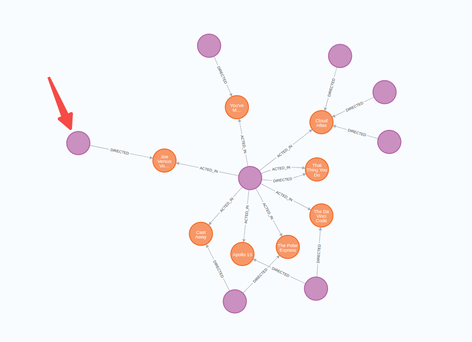

# Neo4j 技术分享文档介绍

Neo4j是一种开源的图形数据库，使用Java编写。它是一种NoSQL数据库，专门设计用于存储和管理图形数据。Neo4j提供了一种高度可扩展和灵活的数据模型，使开发人员能够在处理高度互连的数据时更容易。

## 安装和使用

Neo4j可以在各种操作系统上运行，并提供了多种安装方式。在Windows上，您可以下载并运行Neo4j桌面版，也可以下载并解压缩二进制文件并手动运行Neo4j服务器。在Linux和Mac上，您可以通过命令行下载和运行Neo4j。

一旦Neo4j安装完成并启动，您可以通过浏览器访问Neo4j的Web管理界面。在这里，您可以创建数据库、导入数据、执行查询等。

## Neo4j的基本概念和术语

### 节点（Node）

节点是图形数据库中最基本的构建单元。它代表了实体或对象，并可以包含属性。节点可以具有零个或多个标签，标签是节点的元数据。



### 关系（Relationship）

关系是节点之间的边缘。它表示两个节点之间的联系，并可以包含属性。关系只能连接两个节点。

### 属性（Property）

节点和关系都可以包含属性，属性是键值对的集合，可以为节点或关系添加元数据。

### 标签（Label）

标签是节点的元数据，可以将标签视为节点类型。节点可以具有零个或多个标签。

### 属性键（Property Key）

属性键是用于定义属性的名称。它们是节点和关系属性的架构定义的一部分。

### 属性值（Property Value）

属性值是属性键的值。它们是节点和关系属性的实际值。

### 路径（Path）

路径是一组相互连接的节点和关系，表示两个节点之间的路径。路径可以具有多个中间节点和关系。

## 建立和查询数据

在Neo4j中，您可以使用Cypher查询语言来创建、更新和查询数据。Cypher是一种基于模式匹配的查询语言，它允许您在图形数据上执行类似于SQL的查询。

### 创建节点和关系

使用Cypher可以创建节点和关系。下面是一个创建两个节点和一个关系的示例：

```CSS
CREATE (n1:Person {name: 'Alice'})-[r:KNOWS {since: 2010}]->(n2:Person {name: 'Bob'})
```

在这个

Cypher查询中，CREATE关键字用于创建节点和关系。括号中的内容定义了节点的标签和属性，方括号中的内容定义了关系的类型和属性。箭头表示关系的方向。

### 查询节点和关系

使用Cypher查询语言，可以查询节点和关系。下面是一个查询节点和关系的示例：

```SQL
MATCH (n:Person)-[r:KNOWS]->(m:Person)
WHERE n.name = 'Alice'RETURN n, r, m
```

在这个Cypher查询中，MATCH关键字用于匹配节点和关系。n、r和m是变量，用于引用匹配的节点和关系。WHERE关键字用于指定匹配的条件。RETURN关键字用于指定要返回的节点和关系。

### 更新节点和关系

使用Cypher可以更新节点和关系。下面是一个更新节点属性的示例：

```CSS
MATCH (n:Person {name: 'Alice'})
SET n.age = 30
```

在这个Cypher查询中，MATCH关键字用于匹配节点。SET关键字用于设置节点属性的值。

### 删除节点和关系

使用Cypher可以删除节点和关系。下面是一个删除节点和关系的示例：

```CSS
MATCH (n:Person {name: 'Alice'})-[r:KNOWS]->()
DELETE n, r
```

在这个Cypher查询中，MATCH关键字用于匹配节点和关系。DELETE关键字用于删除匹配的节点和关系。

## 索引

在Neo4j中，索引是用于加速查询的重要工具。它们可以提高查询性能，减少查询时间，特别是在处理大量数据时。Neo4j支持多种类型的索引，包括节点和关系的属性索引、全文索引和空间索引。

节点和关系属性索引

节点和关系属性索引是最常用的索引类型。它们允许您根据节点或关系的属性值快速查找节点和关系。为了创建节点和关系属性索引，您需要使用CREATE INDEX语句。

例如，如果您有一个名为“Person”的标签，并且想要在名字属性上创建一个索引，可以使用以下命令：

CREATE INDEX ON :Person(name)

这将在“name”属性上为“Person”标签创建一个索引。

## 范围索引(Range indexes)

### 全文索引

全文索引用于在文本字段中搜索文本。它们支持模糊匹配、语义匹配、排序等功能。在Neo4j中，您可以使用全文索引来搜索节点的标签、属性和关系类型。

为了创建全文索引，您需要使用CREATE FULLTEXT INDEX语句。例如，如果您有一个名为“Article”的标签，并且想要在“title”属性上创建一个全文索引，可以使用以下命令：

CREATE FULLTEXT INDEX ON :Article(title)

这将在“title”属性上为“Article”标签创建一个全文索引。

### 空间索引

空间索引用于在二维空间中搜索节点。它们支持几何形状查询、距离查询等功能。在Neo4j中，您可以使用空间索引来搜索节点的经纬度坐标。

为了创建空间索引，您需要使用CREATE INDEX语句，并指定索引类型为spatial。例如，如果您有一个名为“Location”的标签，并且想要在“latitude”和“longitude”属性上创建一个空间索引，可以使用以下命令：

CREATE INDEX ON :Location(latitude, longitude) WHERE exists(latitude) AND exists(longitude)

这将在“latitude”和“longitude”属性上为“Location”标签创建一个空间索引，并过滤掉空属性值。

###  总结

在Neo4j中，索引是用于加速查询的重要工具。节点和关系属性索引、全文索引和空间索引是最常用的索引类型。它们可以提高查询性能，减少查询时间，特别是在处理大量数据时。为了创建索引，您需要使用CREATE INDEX语句，并指定索引类型和所需的属性。

## 总结

Neo4j是一种开源的图形数据库，专门设计用于存储和管理图形数据。它提供了一种高度可扩展和灵活的数据模型，使开发人员能够更容易地处理高度互连的数据。在Neo4j中，节点是最基本的构建单元，关系是节点之间的边缘。Cypher查询语言是一种基于模式匹配的查询语言，用于在Neo4j中创建、更新和查询数据。