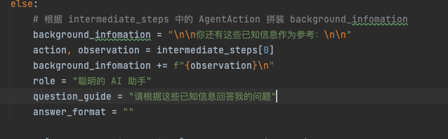
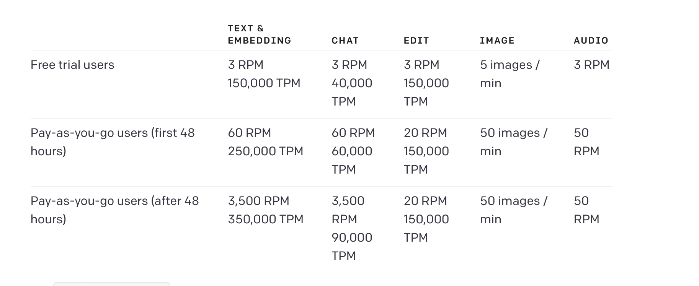
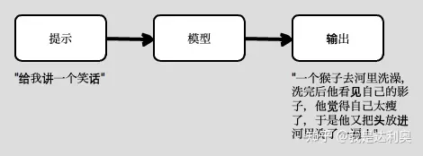
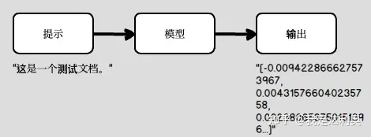

## 基于gpt开发的两种方式

### Fine-tune(微调)

https://zhuanlan.zhihu.com/p/622899519

应用场景

- 文本分类
- 固定模式广告词生成

#### 数据例子

夸赞词生成

```json
{
    "prompt": "对以下商品进行夸赞：彩妆中的口红品类，卖点为颜色是正红色，能提升气色 ->", 
    "completion": " 这口红正红色太好看了，完美提升气色，日常使用特别棒\\n"
}
```

情感分析
```json
{"prompt":"对新的iPhone感到非常高兴！->", "completion":"积极"}
{"prompt":"@湖人连续第三个晚上令人失望 https://t.co/38EFe43 ->", "completion":"消极"}
```

问答可以让gpt根据文本和问题生成答案以此来fine-tune 模型


## 基于prompts




## 模型调用限制



## LangChain是什么？

LangChain创建于2022年10月，是围绕LLMs（大语言模型）建立的一个框架，LLMs使用机器学习算法和海量数据来分析和理解自然语言，GPT3.5、GPT4是LLMs最先进的代表，国内百度的文心一言、阿里的通义千问也属于LLMs。LangChain自身并不开发LLMs，它的核心理念是为各种LLMs实现通用的接口，把LLMs相关的组件“链接”在一起，简化LLMs应用的开发难度，方便开发者快速地开发复杂的LLMs应用。LangChain目前有两个语言的实现：python和nodejs。

接下来我们从两个方面全面的了解LangChain，一是LangChain组件的基础概念，二是LangChain常见的使用场景。

## 组件

一个LangChain应用是通过很多个组件实现的，LangChain主要支持6种组件：

- Models：模型，各种类型的模型和模型集成，比如GPT-4,GPT-3.5,ChatGLM-6B(清华开源模型)
- Prompts：提示，包括提示管理、提示优化和提示序列化
- Memory：记忆，用来保存和模型交互时的上下文状态
- Indexes：索引，用来结构化文档，以便和模型交互
- Chains：链，一系列对各种组件的调用
- Agents：代理，决定模型采取哪些行动，执行并且观察流程，直到完成为止

下面我们了解一下这些组件的作用。

### Model

LangChain为GPT4这些第三方的模型提供通用接口，目前支持三种类型的模型

- #### LLMs
  
- 
  
  - LLMs（大语言模型）接收文本字符作为输入，返回的也是文本字符
  - ChatGLM-6B
  
  现在LangChain支持的LLMs模型有：
  
  | 模型              | 介绍                                                         |
  | ----------------- | ------------------------------------------------------------ |
  | AI21              | [https://docs.ai21.com/](https://link.zhihu.com/?target=https%3A//docs.ai21.com/)是构建理解和生成自然语言的人工智能应用的平台，由Jurassic-1语言模型驱动 |
  | Aleph Alpha       | [https://docs.aleph-alpha.com/docs/introduction/luminous/](https://link.zhihu.com/?target=https%3A//docs.aleph-alpha.com/docs/introduction/luminous/)是一个大型语言模型家族。 |
  | Azure OpenAI      | 微软Azure提供的OpenAI云端API                                 |
  | Banana            | [https://www.banana.dev/about-us](https://link.zhihu.com/?target=https%3A//www.banana.dev/about-us)专注于构建机器学习基础设施。 |
  | CerebriumAI       | Cerebrium是AWS Sagemaker的一个替代品，它提供对[https://docs.cerebrium.ai/cerebrium/prebuilt-models/deployment](https://link.zhihu.com/?target=https%3A//docs.cerebrium.ai/cerebrium/prebuilt-models/deployment)的API访问。 |
  | Cohere            | [https://cohere.ai/about](https://link.zhihu.com/?target=https%3A//cohere.ai/about)是一家加拿大创业公司，提供自然语言处理模型，帮助公司改善人机互动。 |
  | DeepInfra         | DeepInfra提供了[https://deepinfra.com/models](https://link.zhihu.com/?target=https%3A//deepinfra.com/models)。 |
  | Forefront         | Forefront平台让你有能力微调和使用[https://docs.forefront.ai/forefront/master/models](https://link.zhihu.com/?target=https%3A//docs.forefront.ai/forefront/master/models)。 |
  | GooseAI           | GooseAI是一个完全管理的NLP-as-a-服务，通过API交付。GooseAI提供对[https://goose.ai/docs/models](https://link.zhihu.com/?target=https%3A//goose.ai/docs/models)的访问。 |
  | gpt4all           | [https://github.com/nomic-ai/gpt4all](https://link.zhihu.com/?target=https%3A//github.com/nomic-ai/gpt4all)是一个开源聊天机器人的生态系统，在大量干净的助理数据（包括代码、故事和对话）上进行培训。 |
  | Hugging Face Hub  | [https://huggingface.co/docs/hub/index](https://link.zhihu.com/?target=https%3A//huggingface.co/docs/hub/index)是一个拥有超过12万个模型、2万个数据集和5万个演示应用程序（Spaces）的平台，所有这些都是开源和公开的，在一个在线平台上，人们可以轻松合作，共同构建ML。 |
  | Llama-cpp         | [https://github.com/abetlen/llama-cpp-python](https://link.zhihu.com/?target=https%3A//github.com/abetlen/llama-cpp-python)是llama.cpp的一个Python绑定。它支持[https://github.com/ggerganov/llama.cpp](https://link.zhihu.com/?target=https%3A//github.com/ggerganov/llama.cpp)。 |
  | Manifest          | [https://github.com/HazyResearch/manifest](https://link.zhihu.com/?target=https%3A//github.com/HazyResearch/manifest)是一个帮助你利用自然语言生成和计算机视觉创建引人入胜和互动内容的平台 |
  | Modal             | [https://modal.com/docs/guide](https://link.zhihu.com/?target=https%3A//modal.com/docs/guide)提供了方便的、按需的、从你本地计算机上的Python脚本访问serverless云计算的机会。Modal本身并不提供任何LLM，而只是提供基础设施。 |
  | NLP Cloud         | [https://nlpcloud.io/](https://link.zhihu.com/?target=https%3A//nlpcloud.io/)提供高性能的预训练或定制模型，用于NER、情感分析、分类、总结、转述、语法和拼写纠正、关键字和关键词提取、聊天机器人、产品描述和广告生成、意图分类、文本生成、图像生成、博客文章生成、代码生成、问题回答、自动语音识别、机器翻译、语言检测、语义搜索、语义相似性、标记化、POS标记、嵌入和依赖性解析。它已准备好用于生产，通过REST API提供服务。 |
  | OpenAI            | [https://platform.openai.com/docs/introduction](https://link.zhihu.com/?target=https%3A//platform.openai.com/docs/introduction)提供了一系列模型，适用于不同的任务。 |
  | Petals            | Petals以BitTorrent的方式运行100B以上的语言模型。             |
  | PipelineAI        | PipelineAI允许你在云中大规模地运行你的ML模型，提供了对[https://pipeline.ai/](https://link.zhihu.com/?target=https%3A//pipeline.ai/)的API访问。 |
  | PredictionGuard   | 一个帮助你监测和改善生产中机器学习模型性能的平台             |
  | PromptLayer       | [https://www.promptlayer.com/](https://link.zhihu.com/?target=https%3A//www.promptlayer.com/)是第一个允许你跟踪、管理和分享GPT提示工程的平台，扮演代码和OpenAI python库中间件的角色。 |
  | Replicate         | [https://replicate.com/blog/machine-learning-needs-better-tools](https://link.zhihu.com/?target=https%3A//replicate.com/blog/machine-learning-needs-better-tools)在云中运行机器学习模型。我们有一个开源模型库，你只需要几行代码就可以运行。如果你正在建立自己的机器学习模型，Replicate可以让你轻松地大规模部署它们。 |
  | Runhouse          | [https://github.com/run-house/runhouse](https://link.zhihu.com/?target=https%3A//github.com/run-house/runhouse)允许跨环境和用户的远程计算和数据。 |
  | SageMakerEndpoint | [https://aws.amazon.com/sagemaker/](https://link.zhihu.com/?target=https%3A//aws.amazon.com/sagemaker/)是Amazon的一个系统，可以通过完全管理的基础设施、工具和工作流程为任何使用情况建立、训练和部署机器学习（ML）模型。 |
  | StochasticAI      | [https://docs.stochastic.ai/docs/introduction/](https://link.zhihu.com/?target=https%3A//docs.stochastic.ai/docs/introduction/)旨在简化深度学习模型的生命周期。从模型的上传和改版，到训练、压缩和加速，再到投入生产。 |
  | Writer            | [https://writer.com/](https://link.zhihu.com/?target=https%3A//writer.com/)是一个使用AI提升公司业务流程的平台。 |
  
- #### 聊天模型

  - 聊天模型基于LLMs，不同的是它接收聊天消息作为输入，返回的也是聊天消息
  - 聊天消息是一种特定格式的数据，LangChain中支持四种消息`AIMessage`, `HumanMessage`, `SystemMessage` ,`ChatMessage` ，你需要按照它们的角色把数据传递给模型，
  
  LangChain现在支持的聊天模型有：
  
  | 模型                  | 介绍                                                         |
  | --------------------- | ------------------------------------------------------------ |
  | ChatAnthropic         | 一个前OpenAI员工创建的AI聊天助手，相比其他聊天工具，它的有害答案更少 |
  | AzureChatOpenAI       | Azure提供的OpenAI聊天模型                                    |
  | ChatOpenAI            | OpenAI聊天模型                                               |
  | PromptLayerChatOpenAI | 基于OpenAI的提示模板平台                                     |
  
- #### Embedding(文本嵌入模型)

  文本嵌入模型将字符串作为输入，返回一个浮动数的列表。

  

  嵌入（*Embedding*）是NLP中的一个专业名词，把不可计算的非结构化数据转换成可计算的结构化数据，比如在一个句子中，单词的序列是“A B C D E”，NLP处理这个句子时，并不是把“A”、“B”、“C”这些单词输入模型，而是把单词转换为向量，比如“A”对应的向量为[0.7 0.5]，“B”对应的向量为[0.2 -0.1]，再把这些向量输入模型。

  文本嵌入模型可以为文本创建向量映射，这样就能在向量空间里去考虑文本，执行诸如语义搜索之类的操作，比如说寻找相似的文本片段。

  我们看一个OpenAI文本嵌入模型的例子。

  首先导入依赖：

  ```text
  from langchain.embeddings import OpenAIEmbeddings
  ```

  实现文本嵌入：

  ```text
  embeddings = OpenAIEmbeddings()
  text = "这是一个测试文档。"
  
  query_result = embeddings.embed_query(text)
  doc_result = embeddings.embed_documents([text])
  
  print(query_result)
  
  # [-0.009422866627573967, 0.004315766040235758, 0.002380653750151396, -0.010300650261342525, -0.010433647781610489, 0.004894305020570755, -0.018366944044828415, -0.0019317874684929848, -0.004282516892999411, -0.017076868563890457, 0.0149622093886137, 0.024006033316254616, -0.014097725972533226, 0.007141961250454187, -0.004149519372731447, 0.012588205747306347, 0.012668004259467125, -0.018712736666202545, 0.005163624882698059, -0.00768725061789155, 0.002561862813308835, 0.002515313681215048, -0.010673042386770248, 0.007840197533369064, -0.038170259445905685, 0.010819340124726295, 0.01157077495008707, -0.02557540312409401, 0.011072034947574139, -0.01421742420643568, 0.018912233412265778, ...]
  ```

  在这段代码中我们使用了`embed_query`和`embed_documents`两个方法，它们最大的不同是embed_query接收一个字符串作为输入，而embed_documents可以接收一组字符串，一些模型自身划分了这两个方法，LangChain也保留了下来。

  LangChain集成的文本嵌入模型有：

  | 模型                   |
  | ---------------------- |
  | Aleph Alpha            |
  | AzureOpenAI            |
  | Cohere                 |
  | Fake Embeddings        |
  | Hugging Face Hub       |
  | InstructEmbeddings     |
  | Jina                   |
  | Llama-cpp              |
  | OpenAI                 |
  | SageMaker Endpoint     |
  | Self Hosted Embeddings |
  | SentenceTransformers   |
  | TensorflowHub          |

通常作为输入传递给模型的信息被称为提示，提示可以是文本字符，也可以是文件、图片甚至是视频，LangChain目前只支持字符形式的提示。

### Prompt

提示一般不是硬编码的形式写在代码里，而是由模板和用户输入来生成，LangChain提供多个类和方法来构建提示。

- 提示模板

  - 提示模板是一种生成提示的方式，包含一个带有可替换内容的模板，从用户那获取一组参数并生成提示
  - 提示模板用来生成LLMs的提示，最简单的使用场景，比如“我希望你扮演一个代码专家的角色，告诉我这个方法的原理{code}”。

- 聊天提示模板

  聊天模型接收聊天消息作为输入，再次强调聊天消息和普通字符是不一样的，聊天提示模板的作用就是为聊天模型生成提示

- 示例选择器

  示例选择器是一个高级版的数据筛选器，举个例子，我们在实现一个提示模板时，有这么一组原始数据：

```text
 examples = [     {"input": "happy", "output": "sad"},     {"input": "tall", "output": "short"},     {"input": "energetic", "output": "lethargic"},     {"input": "sunny", "output": "gloomy"},     {"input": "windy", "output": "calm"}, ]
```

  	我们可以实现一个示例选择器，也可以使用内置的产品需求是根据用户提供的参数来筛选数据，参数是number类型，

- 输出解析器
  - 由于模型返回的是文本字符，输出解析器可以把文本转换成结构化数据


### Indexes

索引是指几种结构化文档的方式，以便可以与LLMs更好的交互。最常见的使用场景是文档检索，接收用户查询，返回最相关的文档。要注意的是索引也能用在除了检索外的其他场景，同样检索除了索引外也有其他的实现方式。

大多数时间，索引都是和检索非结构化数据（比如文本文档）相关，LangChain支持的主要索引类型如下，它们都是围绕着向量数据库的。

- 文档加载器

  - 负责加载各个来源的文档的类

- 文本分割器

  - 有时候需要把大的文档分割成小片段来和模型交互，比如GPT3.5只支持4,096 token的输入，文本分割器负责这个工作

- 检索

  - 一种保存数据的方式，以便让模型进行查询。

- Vectorstores

  - 最常见的索引类型是为每个文档创建嵌入（使用嵌入模型），vectorstore存储文档和关联的嵌入，并且提供查询相关文档的快速方式。

### Memory

​        模型是无状态的，不保存上一次交互时的数据，回想一下OpenAI的API服务，它是没有上下文概念的，而chatGPT是额外实现了上下文功能。

为了提供上下文的功能，LangChain提供了记忆组件，用来在对话过程中存储数据。

### Chain

链是一个很形象的概念，把一个个独立的组件链接在一起，这也是LangChain名字的由来。

### Agent

有些应用并不是一开始就确定调用哪些模型，而是依赖于用户输入，代理就提供了一套工具，根据用户的输入来决定调用这些工具种的哪一个。LangChain提供了下面的组件：

- Tools

  - 用来方便模型和其他资源交互

    例如: 谷歌搜素,数学计算,程序执行

  例子

  谷歌搜索: 最近瓦格纳叛变的原因

  数学: 781乘以789等于多少

  

  

  


天气: 今天北京的温度

程序执行: print("administration"[7])  #t


# 基于文档对话的实现流程

