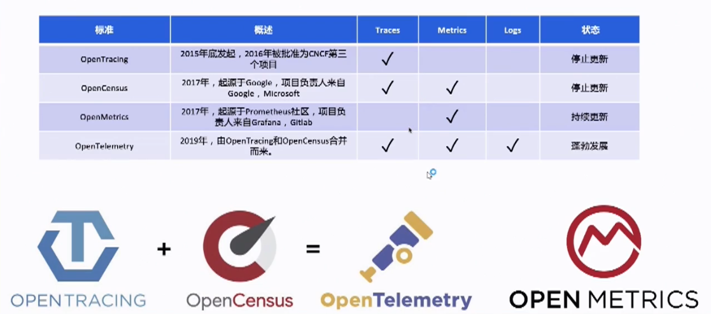
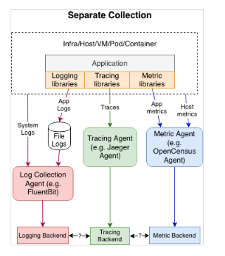
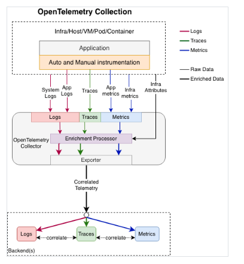
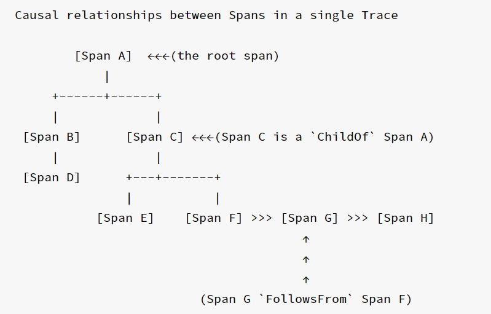
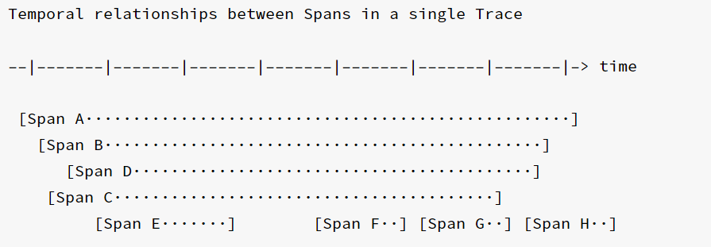
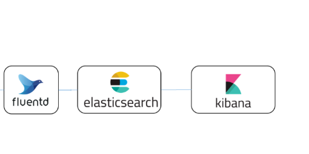
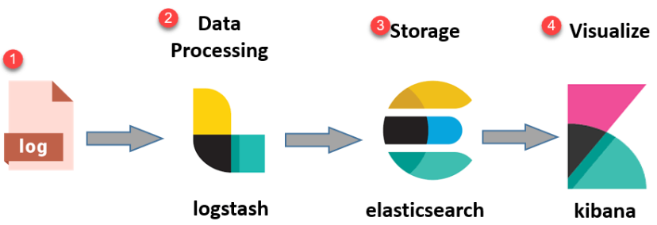
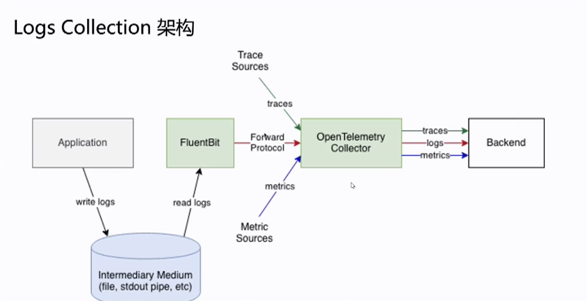
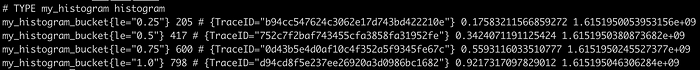

# 链路追踪

## 一,  OpenTelemetry 概述



### Signals

#### Logs

记录构成事务的各个事件。

#### Metrics

记录构成一个事务的事件的集合。

#### Traces

测量操作的延迟和识别事务中的性能瓶颈，或者类似的东西。传统上，许多组织并不使用分布式追踪，许多开发人员也不熟悉它。

#### Baggage

### Opentelemetry 和传统观测方式对比






## Traces





### Spans[](https://opentelemetry.io/docs/concepts/signals/traces/#spans)

span是trace组成的基本单元.

下面是一个简单的span内容

```JSON
{
  "trace_id": "7bba9f33312b3dbb8b2c2c62bb7abe2d",
  "parent_id": "49e70a244dea2267",
  "span_id": "086e83747d0e381e",
  "name": "/v1/sys/health",
  "start_time": "2021-10-22 16:04:01.209458162 +0000 UTC",
  "end_time": "2021-10-22 16:04:01.209514132 +0000 UTC",
  "status_code": "STATUS_CODE_OK",
  "status_message": "",
  "attributes": {
    "net.transport": "IP.TCP",
    "net.peer.ip": "172.17.0.1",
    "net.peer.port": "51820",
    "net.host.ip": "10.177.2.152",
    "net.host.port": "26040",
    "http.method": "GET",
    "http.target": "/v1/sys/health",
    "http.server_name": "mortar-gateway",
    "http.route": "/v1/sys/health",
    "http.user_agent": "Consul Health Check",
    "http.scheme": "http",
    "http.host": "10.177.2.152:26040",
    "http.flavor": "1.1"
  },
  "events": [
    {
      "name": "",
      "message": "OK",
      "timestamp": "2021-10-22 16:04:01.209512872 +0000 UTC"
    }
  ]
}
```

### Span Context(跨度的上下文)

| 属性                     | 类型                  | 定义                                                                                     | 示例                                                                                                                                                               |
| ---------------------- | ------------------- | -------------------------------------------------------------------------------------- | ---------------------------------------------------------------------------------------------------------------------------------------------------------------- |
| TraceId                | 16字节数组 (`[16]byte`) | 唯一跟踪标识符                                                                                | `7bba9f33312b3dbb8b2c2c62bb7abe2d`                                                                                                                               |
| ParentSpanId           | 8字节数组 (`[8]byte`)   | 调用当前span的父span的ID                                                                      | `49e70a244dea2267`                                                                                                                                               |
| SpanId                 | 8字节数组 (`[8]byte`)   | 唯一跟踪标识符                                                                                | `086e83747d0e381e`                                                                                                                                               |
| Name                   | 字符串                 | 当前span的名称                                                                              | `/v1/sys/health`                                                                                                                                                 |
| Kind                   | 枚举                  | span的类别。选项包括`SPAN_KIND_UNSPECIFIED`、`SERVER`、`CLIENT`、`PRODUCER`、`CONSUMER`和`INTERNAL` | `SERVER`                                                                                                                                                         |
| StartTime              | int64               | span的起始时间，以自纪元以来的纳秒数表示                                                                 | `1625635230123456789`                                                                                                                                            |
| EndTime                | int64               | span的结束时间，以自纪元以来的纳秒数表示                                                                 | `1625635231123456789`                                                                                                                                            |
| Attributes             | map                 | 附加到span的一组具有字符串键和类型值的属性                                                                | `{ "http.method": "GET", "http.url": "https://example.com" }`                                                                                                    |
| Events                 | slice               | 要附加到span的事件列表。每个事件都有一个时间戳和一组具有字符串键和类型值的属性                                              | `[{ "name": "timeout", "timestamp": 1625635231123456789 }]`                                                                                                      |
| Links                  | slice               | 要附加到其他span的链接列表。每个链接都有一个跟踪ID、一个span ID和一组具有字符串键和类型值的属性                                 | `[{ "trace_id": "7bba9f33312b3dbb8b2c2c62bb7abe2d", "span_id": "086e83747d0e381e", "attributes": { "http.method": "GET", "http.url": "https://example.com" } }]` |
| Status                 | 枚举                  | span的状态。选项包括 `Unset`、`OK`、`ERROR`                                                      | `OK`                                                                                                                                                             |
| StatusCode             | int32               | span的状态代码。与`Status`字段一起使用                                                              | `0`                                                                                                                                                              |
| StatusMessage          | 字符串                 | span的状态消息。与`Status`字段一起使用                                                              | `success`                                                                                                                                                        |
| DroppedAttributesCount | int32               | 由于资源限制而从span中删除的属性数量                                                                   | `0`                                                                                                                                                              |
| DroppedEventsCount     | int32               | 由于资源限制而从span中删除的事件数量                                                                   | `0`                                                                                                                                                              |
| DroppedLinksCount      | int32               | 由于资源限制而从span中删除的链接数量                                                                   | `0`                                                                                                                                                              |

#### Attributes(属性)

最基本的数据结构是**属性（attribute）**，定义为一个键和一个值。OpenTelemetry 的每个数据结构都包含一个属性列表。分布式系统的每个组件（HTTP 请求、SQL 客户端、无服务器函数、Kubernetes Pod）在 OpenTelemetry 规范中都被定义为一组特定的属性。这些定义被称为 OpenTelemetry **语义约定**。下面为 HTTP 约定的部分列表。

| 属性               | 类型     | 描述                                                                                                      | 示例              |
| ---------------- | ------ | ------------------------------------------------------------------------------------------------------- | --------------- |
| http.method      | string | HTTP 请求类型                                                                                               | GET; POST; HEAD |
| http.target      | string | 在 HTTP 请求行中传递的完整的请求目标或等价物                                                                               | /path/12314/    |
| http.host        | string | HTTP [host header](https://datatracker.ietf.org/doc/html/rfc7230#section-5.4) 的值。当标头为空或不存在时，这个属性应该是相同的。 | www.example.org |
| http.scheme      | string | 识别所使用协议的 URI 方案                                                                                         | http; https     |
| http.status_code | int    | HTTP 请求状态码                                                                                              | 200             |

```go
    span.SetAttributes(attribute.String("user.name", username))
```

#### Events（内嵌日志）

可以用来记录请求的入参和响应的值,以及一些关键时间

1. 长时间处理 - 当一个操作需要花费很长时间才能完成时，可以使用 span events 来记录每个阶段的事件。例如，在处理一份大型文件时，您可以使用 span events 记录文件读取、处理和写入阶段的事件。

```go
 span.AddEvent("end to get user",
        trace.WithTimestamp(time.Now()),
        trace.WithAttributes(attribute.String("user.name", username)),
    )
```

#### Span

Status 可以用来设置span状态

```go
// 设置成功
span.SetStatus(codes.Ok, "")
// 设置失败
span.SetStatus(codes.Error, err.Error())
```

#### Links

聚合多个span,如接收kafka数据处理,批处理1000，就会把1000个span聚合成一个,下面就是聚合的举例

```go
package main

import (
    "context"
    "go.opentelemetry.io/otel/attribute"

    "go.opentelemetry.io/otel"
    "go.opentelemetry.io/otel/trace"
)

func main() {
    // Create a stdout exporter

    // Get a tracer instance
    tracer := otel.Tracer("example")

    ctx := context.Background()

    // Create a span context for the linked span
    sc:=trace.NewSpanContext(trace.SpanContextConfig{
        TraceID:    [16]byte{0x00, 0x01, 0x02, 0x03},
        SpanID:     [8]byte{0x04, 0x05, 0x06, 0x07},
        TraceFlags: trace.FlagsSampled,
    })

    link := trace.Link{
        SpanContext: sc,
        Attributes: []attribute.KeyValue{
            attribute.String("link_attr", "value"),
        },
    }
    sc2:=trace.NewSpanContext(trace.SpanContextConfig{
        TraceID:    [16]byte{0x00, 0x01, 0x02, 0x03},
        SpanID:     [8]byte{0x04, 0x05, 0x06, 0x06},
        TraceFlags: trace.FlagsSampled,
    })

    // Create a link object with the span context and some attributes
    link2 := trace.Link{
        SpanContext: sc2,
        Attributes: []attribute.KeyValue{
            attribute.String("link_attr", "value"),
        },
    }
    ctx, span := tracer.Start(ctx, "my_span", trace.WithLinks(link,link2))
    defer span.End()

}
```

### Baggage

baggae中的内容会随着trace 不停的透传。例: 可以用来记录用户id

### 采样策略

Go SDK 提供了几个基本的采样器:

- `AlwaysSample()`: 全部采样
- `NeverSample()`: 全部丢弃
- `TraceIDRatioBased(fraction float64)`: 设置采样率
- `ParentBased(root Sampler, samplers ...ParentBasedSamplerOption)`: 基于parent span 设置采样策略

```go
	tp := sdktrace.NewTracerProvider(
    // 设置采样器
		sdktrace.WithSampler(sdktrace.AlwaysSample()),
	)
```


#### when and where(全采样)

所有的请求全部采样

#### Head-based sampling(头部采样)

头部采样：在根链路的产生的时候来进行采样策略判断是否进行采样。
目前主流的分布式跟踪框架都主要使用这一方式，虽然头部采样的形式能比较好降低span的产生，但是在实际生产中，大部分都是正常的链路，少部分才是异常链路，采样策略可能会将错误链路给命中，导致异常被遗漏。基于头部的采样，是需要在TRACE-SDK进行配置，它直接在应用程序生效，所以管控这个配置是有成本的。如果在微服务更个服务比较独立的时候还存在一些服务开启了采样，一些服务没有开启采样，这就会导致某几个未开启服务产生大量span对整个上下游服务进行了传播，导致后端服务压力大增。

#### 尾部采样

链路中有错误或满足自定义条件才进行采样记录,这个所有的span都要上传到opentelemetry-collector由它判断是否进行采样

## Logs







log可以选用日志收集工具,例如(Logstash、Fluentd、Fluent Bit 和 Vector)等,把日志推送给opentelemetry。

opentelemetry 也支持通过文件收集日志

日志和trace通过TraceId和SpanId进行关联

| Field Name           | Description        | Type             |
|:-------------------- |:------------------ |:---------------- |
| Timestamp            | 事件发生的时间。           | int64            |
| ObservedTimestamp    | 事件被观察到的时间。         | int64            |
| TraceId              | 请求的 trace id。      | string           |
| SpanId               | 请求的 span id。       | string           |
| TraceFlags           | W3C 的 trace flag。  | byte             |
| SeverityText         | 严重性文本（也称为日志级别）。    | string           |
| SeverityNumber       | 严重性的数值(日志级别对应的数字)。 | int32            |
| Body                 | 日志记录的内容。           | any              |
| Resource             | 描述日志的来源。           | Resource         |
| InstrumentationScope | 描述发出日志的范围。         | string           |
| Attributes           | 关于事件的额外信息。         | map<string, any> |

## Metrics

### 基本类型

### 同步类型

同步类型,它们正在测量的操作一起被调用。例如，要测量请求数，您可以`counter.Add(ctx, 1)`在有新请求时调用。同步metrics可以关联的trace

**Counter** ：递增的计数器。

**UpDownCounter**：可增可减的计数器。

**Histogram**：统计一组数据，如直方图。

#### 异步类型

异步仪器（观察者）定期调用回调函数来收集测量值。例如，您可以使用观察器定期测量内存或 CPU 使用率。异步metrics不能关联的trace

**CounterObserver**：异步方式的递增计数器。

**UpDownCounterObserver**：异步方式的可增可减计数器。

**GaugeObserver**：异步的方式观测最新数据的计量器。

### Exemplar

它可以为一条metric,在不增加label的情况下,增加附加一条信息,这条信息可以用来存储trace_id



参考[1]:

https://www.cnblogs.com/charlieroro/p/13883578.html#asynchronous-instrument

## 存储端

存储端对比

| 存储端         | 支持的数据类型              | 优点                                                          | 缺点                                        |
| ----------- | -------------------- | ----------------------------------------------------------- | ----------------------------------------- |
| Zipkin      | trace                | 轻量级，易于部署和使用，支持多种语言和框架                                       | 不支持 metrics 和 logs，查询和可视化功能有限，不支持高可用和水平扩展 |
| Jaeger      | trace, metrics (实验性) | 支持高可用和水平扩展，提供丰富的查询和可视化功能，支持采样策略和自适应采样                       | 不支持 logs，需要额外的组件如 Kafka 和 Cassandra       |
| Prometheus  | metrics              | 支持多维度的数据模型和强大的查询语言，提供高性能和可靠性，支持服务发现和告警                      | 不支持 trace 和 logs，不支持长期存储和水平扩展             |
| SigNoz      | trace, metrics,logs  | 支持 OpenTelemetry 标准，提供自定义仪表盘和告警功能，使用 ClickHouse 存储数据，提高查询效率 | 项目相对较新，社区和文档还不完善                          |
| Uptrace     | trace, metrics, logs | 支持 OpenTelemetry 标准，提供实时分析、可视化、告警等功能，支持多种语言和框架，支持自主部署或云服务   | 项目相对较新，社区和文档还不完善                          |
| Skywalking  | trace, metrics, logs | 支持全栈监控，提供拓扑分析、告警、异常检测等功能，支持多种语言和框架                          | 需要额外的组件如 ElasticSearch 或 H2               |
| Elastic APM | trace, metrics, logs | 基于 Elastic Stack，提供实时分析、可视化、告警等功能，支持多种语言和框架                 | 需要额外的组件如 ElasticSearch 或 Kibana           |
| AWS X-Ray   | trace, metrics       | 与亚马逊云服务集成，提供服务地图、故障排查、性能分析等功能，支持多种语言和框架                     | 不支持 logs，需要亚马逊云账号和服务                      |
| Datadog     | trace, metrics, logs | 提供全面的应用性能监控、安全分析、日志管理等功能，支持多种语言和框架，支持云服务和容器平台               | 需要付费使用，不支持自主部署                            |

## 环境变量

| **环境变量**                                | **作用**                 | **示例**                                                |
| --------------------------------------- | ---------------------- | ----------------------------------------------------- |
| **OTEL_EXPORTER_OTLP_ENDPOINT**         | 指定OTLP exporter的地址     | [<u>http://localhost:4317</u>](http://localhost:4317) |
| **OTEL_EXPORTER_OTLP_INSECURE**         | 指定是否使用不安全的连接           | true 或 "false"                                        |
| **OTEL_EXPORTER_OTLP_HEADERS**          | 指定OTLP exporter的HTTP头  | key1=value1;key2=value2                               |
| **OTEL_EXPORTER_OTLP_TIMEOUT**          | 指定OTLP exporter的超时时间   | 5s                                                    |
| **OTEL_EXPORTER_OTLP_CERTIFICATE**      | 指定OTLP exporter的证书     | <base64_encoded_certificate>                          |
| **OTEL_EXPORTER_OTLP_CERTIFICATE_FILE** | 指定OTLP exporter的证书文件路径 | /path/to/certificate.pem                              |
| **OTEL_EXPORTER_OTLP_CERTIFICATE_DATA** | 指定OTLP的证书数据            | <base64_encoded_certificate>                          |
| **OTEL_EXPORTER_OTLP_COMPRESSION**      | 指定OTLP exporter的压缩方式   | gzip 或 "none"                                         |
| **OTEL_RESOURCE_ATTRIBUTES**            | 指定资源属性                 | key1=value1;key2=value2                               |
| **OTEL_SERVICE_NAME**                   | 指定服务名称                 | my_service                                            |
| **OTEL_TRACES_SAMPLER**                 | 指定采样率                  | always_on 或 "always_off" 或 "traceidratio"             |
| **OTEL_TRACES_SAMPLER_ARG**             | 指定采样率参数                | 0.1 (仅适用于 "traceidratio" 采样器)"                        |
| **OTEL_PROPAGATORS**                    | 指定传播器                  | tracecontext,baggage 或 "b3" 或 "jaeger"                |


```sh
// 指定OTLP exporter的地址
export OTEL_EXPORTER_OTLP_ENDPOINT=http://192.168.2.159:4319
// 服务名称
export OTEL_SERVICE_NAME="pallas"
```


## golang 三方库

### 初始化

```go
import (
	"context"
	log "github.com/sirupsen/logrus"
	"gitlab.deepglint.com/deepface/pallas/config"
	"go.opentelemetry.io/otel"
	"go.opentelemetry.io/otel/exporters/otlp/otlptrace/otlptracehttp"
	"go.opentelemetry.io/otel/propagation"
	"go.opentelemetry.io/otel/sdk/resource"
	sdktrace "go.opentelemetry.io/otel/sdk/trace"
	semconv "go.opentelemetry.io/otel/semconv/v1.4.0"
	"os"
)
func oTelTraceProvider() (*sdktrace.TracerProvider, error) {
	exp, err := otlptracehttp.New(context.TODO())
	if err != nil {
		return nil, err
	}
	tp := sdktrace.NewTracerProvider(
		sdktrace.WithBatcher(exp),
		sdktrace.WithResource(resource.NewWithAttributes(
			semconv.SchemaURL,
			semconv.TelemetrySDKLanguageGo,
			semconv.DeploymentEnvironmentKey.String("production"),
		)),
	)
	return tp, nil
}

func InitTracer() (*sdktrace.TracerProvider, error) {
  // 注入环境变量
	envMap := config.GetInstance().GetStringMapString("otel.env")
	for key, val := range envMap {
		if len(os.Getenv(key)) == 0 {
			err := os.Setenv(key, val)
			if err != nil {
				log.Error(err)
			}
		}
	}
	tp, err := oTelTraceProvider()
	if err != nil {
		log.Error(err)
	}
	otel.SetTracerProvider(tp)
	otel.SetTextMapPropagator(propagation.NewCompositeTextMapPropagator(propagation.TraceContext{}, propagation.Baggage{}))
	return tp, err
}
func main() {
	tp, err := otel.InitTracer()
	if err != nil {
		logrus.Error(err)
	}
	defer func() {
		if err := tp.Shutdown(context.TODO()); err != nil {
			logrus.Error(err)
		}
  }()
}
```


### 创建并设置trace的provider

```go
func OTelTraceProvider() (*sdktrace.TracerProvider, error) {
    sdktrace.AlwaysSample()
    // 不使用https
    // otlptracehttp.WithInsecure()
    exp, err := otlptracehttp.New(context.TODO(), otlptracehttp.WithEndpoint("192.168.2.159:4319"), otlptracehttp.WithInsecure())
    if err != nil {
        return nil, err
    }
    tp := sdktrace.NewTracerProvider(
        sdktrace.WithBatcher(exp),
        sdktrace.WithResource(resource.NewWithAttributes(
            semconv.SchemaURL,
            // 服务名称, service.name
            semconv.ServiceNameKey.String("pallas"),
            semconv.DeploymentEnvironmentKey.String("production"),
        )),
    )
    return tp, nil
}
```

### gin

#### install

```shell
go get go.opentelemetry.io/contrib/instrumentation/github.com/gin-gonic/gin/otelgin
```

#### use

```go
router.Use(otelgin.Middleware(""))
```

### net/http

#### install

```sh
go get go.opentelemetry.io/contrib/instrumentation/net/http/otelhttp
```

#### use

创建http client 时,加入Transport

```go
// 创建client 时加入    Transport
client := http.Client{
        Transport: otelhttp.NewTransport(http.DefaultTransport),
}
// 创建req时,使用http.NewRequestWithContext
// 把请求和上面span关联起来
req, _ := http.NewRequestWithContext(ctx, "GET", url, nil)
```

##### 示例

```go
    ctx := context.Background()
    tr := otel.Tracer("example/client")
    ctx, span := tr.Start(ctx, "say hello", trace.WithAttributes(semconv.PeerService("ExampleService")))
    defer span.End()
    url := "http://localhost:8080/t2"
    client := http.Client{
        Transport: otelhttp.NewTransport(http.DefaultTransport),
    }
    // 把请求和上面span关联起来
    req, _ := http.NewRequestWithContext(ctx, "GET", url, nil)
    res, err := client.Do(req)
    if err != nil {
        panic(err)
    }
    body, err := io.ReadAll(res.Body)
    _ = res.Body.Close()
```

### xorm

#### 下载

```go
go get github.com/jenbonzhang/otelxorm@v0.2.0
```

#### use

```go
engine, err := xorm.NewEngine(dbType, dsn)
if err != nil {
    logrus.Errorf("Database connection failed err: %v. Database name: %s", err, name)
    panic(err)
}
// engine 为xorm 的engine
engine.AddHook(otelxorm.Hook(
    otelxorm.WithDBName(name),       // 设置数据库名称
    otelxorm.WithFormatSQLReplace(), // 设置format SQL语句中的参数的替换方法
))
```

### sarama

#### install 

```sh
go get go.opentelemetry.io/contrib/instrumentation/github.com/Shopify/sarama/otelsarama
```

#### use 

##### consumer

consumer获取消息的handler使用otelsarama.WrapConsumerGroupHandler包一层后使用

```go
func startConsumerGroup(ctx context.Context, brokerList []string) error {
	consumerGroupHandler := Consumer{}
	// Wrap instrumentation
	// 此为加入otel,此处可添加tp
    handler := otelsarama.WrapConsumerGroupHandler(&consumerGroupHandler)

	config := sarama.NewConfig()
	config.Version = sarama.V2_5_0_0
	config.Consumer.Offsets.Initial = sarama.OffsetOldest

	// Create consumer group
	consumerGroup, err := sarama.NewConsumerGroup(brokerList, "example", config)
	if err != nil {
		return fmt.Errorf("starting consumer group: %w", err)
	}

	err = consumerGroup.Consume(ctx, []string{example.KafkaTopic}, handler)
	if err != nil {
		return fmt.Errorf("consuming via handler: %w", err)
	}
	return nil
}
```

获取消息中的span和ctx并传递下去

```go

func printMessage(msg *sarama.ConsumerMessage) {
	// 获取message中的trace 信息
	ctx := otel.GetTextMapPropagator().Extract(context.Background(), otelsarama.NewConsumerMessageCarrier(msg))

	tr := otel.Tracer("consumer")
	_, span := tr.Start(ctx, "consume message", trace.WithAttributes(
		semconv.MessagingOperationProcess,
	))
	defer span.End()

	log.Println("Successful to read message: ", string(msg.Value))
}
```

##### producer

在要发送的kafka msg 中注入trace信息

```go
// producer 使用otel包装一层,此位置可配置tp
producer = otelsarama.WrapAsyncProducer(config, producer)
	

msg := sarama.ProducerMessage{
		Topic: example.KafkaTopic,
		Key:   sarama.StringEncoder("random_number"),
		Value: sarama.StringEncoder(fmt.Sprintf("%d", rng.Intn(1000))),
	}
	// 在要发送的kafka msg 中注入trace信息
	otel.GetTextMapPropagator().Inject(ctx, otelsarama.NewProducerMessageCarrier(&msg))
```

### Redis( go-redis)

#### install

```
go get github.com/redis/go-redis/extra/redisotel/v9
```


#### use

Tracing is enabled by adding a hook:

```
import (
    "github.com/redis/go-redis/v9"
    "github.com/redis/go-redis/extra/redisotel/v9"
)

rdb := rdb.NewClient(&rdb.Options{...})

// Enable tracing instrumentation.
if err := redisotel.InstrumentTracing(rdb); err != nil {
	panic(err)
}

// Enable metrics instrumentation.
if err := redisotel.InstrumentMetrics(rdb); err != nil {
	panic(err)
}
```

### Redis(redigo)

https://github.com/signalfx/splunk-otel-go/tree/main/instrumentation/github.com/gomodule/redigo/splunkredigo

### Wesocket


项目中使用的websocket库不再维护，没找到插入trace的方式

### ES

https://github.com/signalfx/splunk-otel-go/tree/main/instrumentation/gopkg.in/olivere/elastic/splunkelastic


### Neo4j

https://github.com/raito-io/neo4j-tracing


### 注意事项

#### 一,  go1.18 使用opentelemetry 版本v1.14.0,不要使用v1.15(这个版本使用了go1.19的新特性)

```sh
go get go.opentelemetry.io/otel@v1.14.0
```

### 遇到问题

#### lint 未过

升级golangci-lint

```
dockerhub.deepglint.com/ci/golangci-lint:v1.52
```
