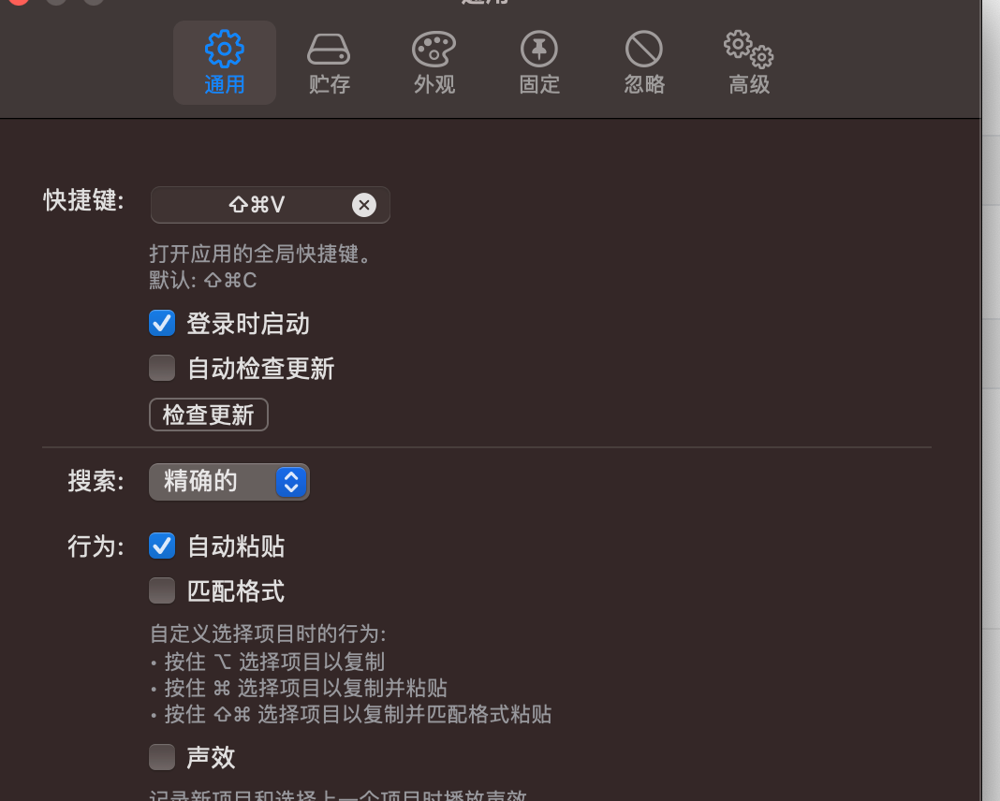
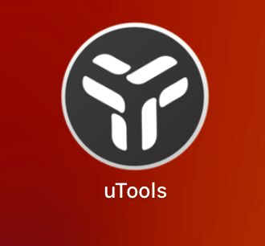

# 使用mac os安装,配置环境

## 编程环境

### sdkman

#### install

安装官网:  https://sdkman.io/install

#### 查看支持的java版本号

可以选用结尾为-open,为open-jdk的版本，结尾为-oracle 为oracle 的jdk

```shell
sdk list java
```

#### 版本号对应

版本对应:   https://sdkman.io/jdks


#### 安装java sdk

```shell
sdk install java <version> # 使用tab键,会自动提示可使用的java版本
```

#### 切换java使用的版本

```shell
sdk use java <version> # 使用tab键,会自动提示可使用的java版本
```


## 粘贴板历史工具

### maccy

**项目地址**: https://github.com/p0deje/Maccy

可以记录粘贴的历史版本.

注意修改快捷键



## 小工具集合包

**utools**

各种小工具的集合包,像json格式化，斗图 等

地址: https://www.u.tools/





## Magnet(窗口工具)

mac中没有像win或这linux中那样的分屏工具,需要软件替代


## CatchMouse(屏幕间切换鼠标焦点)

https://web.archive.org/web/20150502123813/http://ftnew.com:80/catchmouse.html
